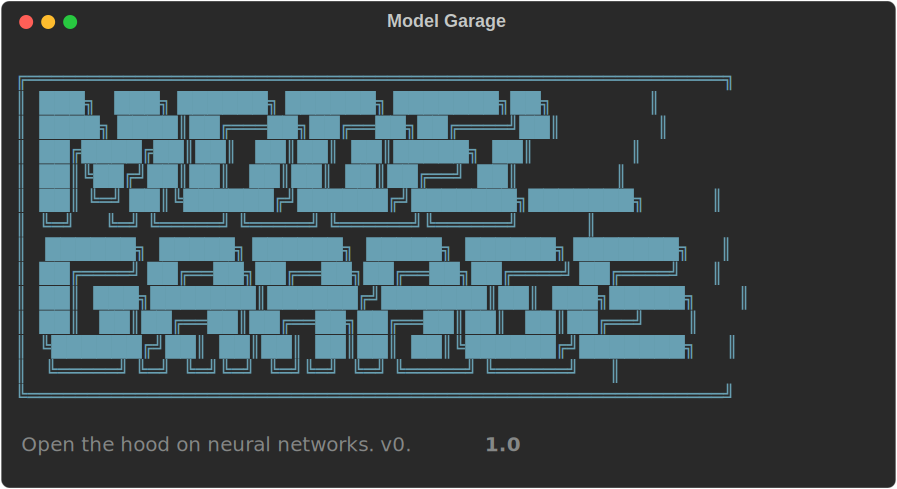
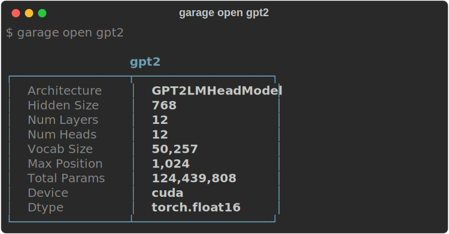
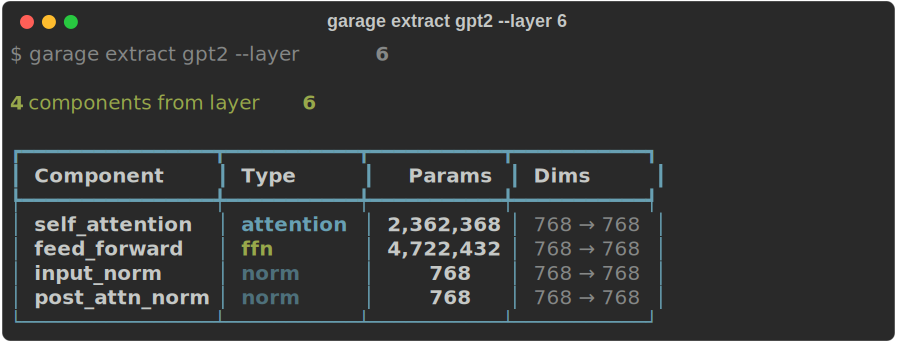
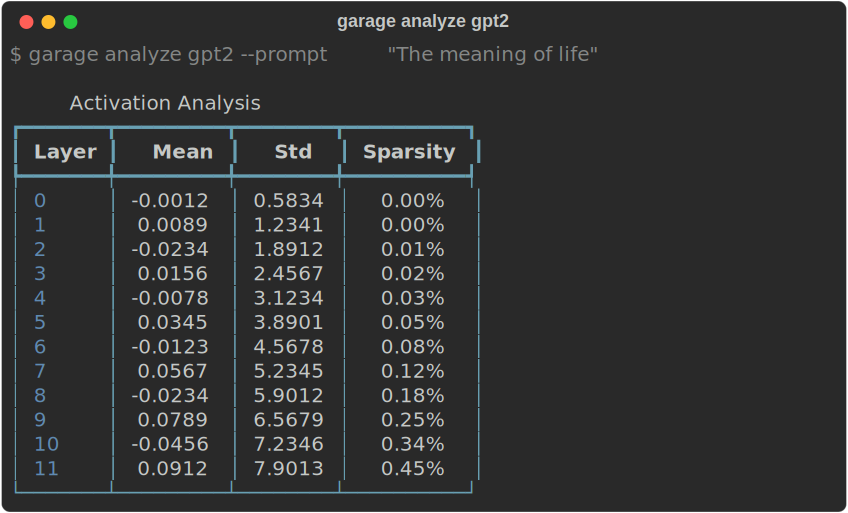
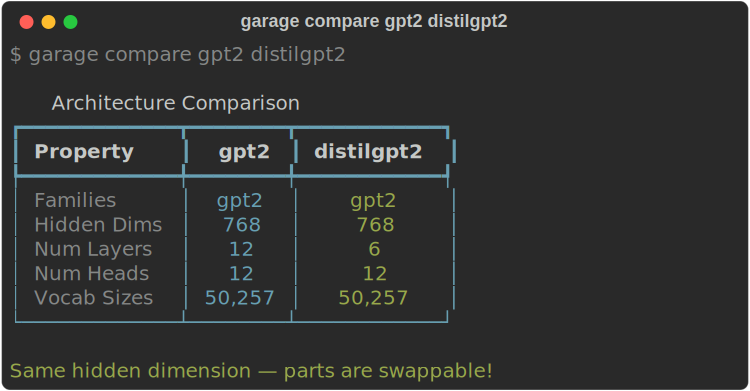

<p align="center">
  
</p>

<p align="center">
  <strong>Open the hood on neural networks.</strong>
</p>

<p align="center">
  <a href="https://pypi.org/project/model-garage/"></a>
  <a href="https://github.com/model-garage/model-garage/blob/main/LICENSE"></a>
  <a href="https://www.python.org/downloads/"></a>
  
  
</p>

---

Component-level model surgery, analysis, and composition. Extract attention heads, swap FFN layers between models, inject capability blades, and build hybrid architectures — all from a beautiful CLI or Python API.

People used to be "Gear Heads" — they could fine-tune actual car engines manually. Model Garage brings that same hands-on philosophy to neural networks. Open the hood, understand the parts, swap what you need.

---

## Quick Start

```bash
pip install model-garage
```

```bash
# Inspect a model's architecture
garage open gpt2

# Extract attention from layer 6
garage extract gpt2 --layer 6 --component self_attention

# Compare two models for compatible parts
garage compare gpt2 distilgpt2

# Analyze activations across layers
garage analyze gpt2 --prompt "The meaning of life is"
```

<details>
<summary><strong>See CLI output examples</strong></summary>

<p align="center"></p>
<p align="center"></p>
<p align="center"></p>
<p align="center"></p>

</details>

Or use the Python API directly:

```python
from model_garage import ModelLoader, ModelRegistry

# Load and decompose
loader = ModelLoader()
model, tokenizer, info = loader.load("gpt2")

registry = ModelRegistry()
spec = registry.register("gpt2", model)

# See all parts
for name, part in spec.parts.items():
    print(f"{name}: {part.part_type.value} [{part.input_dim}→{part.output_dim}]")
```

## What Can You Do?

### Extract

Pull real `nn.Module` components from any supported transformer:

```python
from model_garage.extract.pytorch import PyTorchExtractor

extractor = PyTorchExtractor("microsoft/phi-2")
extractor.load_model()

# Extract attention from layer 12
attn = extractor.extract_component("self_attention", layer_idx=12)

# It's a real module — run it, analyze it, transplant it
output = attn.module(hidden_states)
```

### Inject

Insert custom processing between any two layers without modifying the model:

```python
from model_garage.inject.layer import LayerInjector

with LayerInjector(model) as injector:
    # Scale activations (reduce by 10%)
    injector.inject_scaling("model.layers.12", scale=0.9)

    # Or inject a custom module
    injector.inject_custom_layer("model.layers.12", my_adapter)

    # Model now uses your injection during forward pass
    output = model(input_ids)
# Injections automatically cleaned up
```

### Analyze

Capture and inspect hidden states at any layer:

```python
from model_garage.core.hooks import HookManager
from model_garage.core.tensor import TensorUtils

with HookManager(model) as hooks:
    hooks.register_capture_hook("model.layers.15", hook_name="layer_15")
    model(input_ids)

    data = hooks.get_captured("layer_15")
    stats = TensorUtils.stats(data["output"])
    print(f"Mean: {stats['mean']:.4f}, Sparsity: {stats['sparsity']:.2%}")
```

### Compose

Register multiple models and find compatible parts for hybrid architectures:

```python
from model_garage.registry.models import ModelRegistry

registry = ModelRegistry()
registry.register("gpt2", model_a)
registry.register("distilgpt2", model_b)

# Find what's swappable
comparison = registry.compare("gpt2", "distilgpt2")
print(comparison["compatible_parts"])
```

### Debate

Add multi-perspective reasoning to any model via self-debate chambers:

```python
from model_garage.inject.debate import SelfDebate

# Two perspectives reconciled through learned gating
with SelfDebate(model, layer_idx=6, reconciliation_method="gated"):
    output = model.generate(input_ids, max_new_tokens=50)
```

## Supported Model Families

| Family | Models | Status |
|--------|--------|--------|
| **GPT-2** | gpt2, gpt2-medium, gpt2-large, gpt2-xl, distilgpt2 | Full support |
| **Llama** | Llama-2-7b, Llama-3-8b, TinyLlama, CodeLlama | Full support |
| **Phi** | Phi-2, Phi-3-mini, Phi-3.5, Phi-4 | Full support |
| **Mistral** | Mistral-7B, Mixtral-8x7B | Full support |
| **Gemma** | Gemma-2b, Gemma-7b, Gemma-2-9b | Full support |
| **Qwen** | Qwen-1.5, Qwen-2 | Full support |
| **BERT** | bert-base, bert-large, distilbert | Extraction only |

Adding a new family? See [CONTRIBUTING.md](CONTRIBUTING.md).

## Validated Research

Model Garage includes findings from 17 validated experiments on capability transfer ("blades"):

- **+14.2% accuracy** transferring reasoning capability between models via gated injection
- **7 validated principles** for when and how capability transfer works
- **MoE router control** achieving 1.67x expert selectivity improvement

See [research/](research/) for the full findings, blade principles, and experiment index.

## CLI Commands

| Command | Description |
|---------|-------------|
| `garage open <model>` | Load and display model architecture card |
| `garage extract <model>` | Extract components (attention, FFN, embeddings) |
| `garage analyze <model>` | Analyze activations, entropy, sparsity |
| `garage compare <a> <b>` | Compare architectures, find compatible parts |
| `garage registry list` | List decomposed models in local registry |
| `garage registry add <model>` | Decompose and register a model |

## Project Structure

```
model-garage/
├── src/model_garage/
│   ├── cli/          # Retro-themed CLI (Typer + Rich)
│   ├── core/         # Model loading, hooks, tensor utils
│   ├── extract/      # Component extraction engine
│   ├── inject/       # Layer injection, blades, debate
│   ├── analyze/      # Activation analysis
│   ├── compose/      # Hybrid model builder
│   ├── registry/     # Component registry & decomposition
│   ├── snapshot/     # Hidden state capture
│   └── models/       # Model family adapters
├── examples/         # Runnable example scripts
├── research/         # Validated findings & principles
├── tests/            # Unit & integration tests
└── docs/             # Documentation
```

## Philosophy

> *"People used to be 'Gear Heads' — they could fine-tune actual car engines manually. They understood every part, could diagnose problems by sound, and could build a hot rod from junkyard parts.*
>
> *Modern AI models are the same kind of machine. They have parts — attention heads, feed-forward networks, embeddings, normalization layers. These parts can be extracted, tested, swapped, and recombined.*
>
> *Model Garage makes you a neural network gear head."*

## Contributing

We especially welcome contributions that add support for new model families. See [CONTRIBUTING.md](CONTRIBUTING.md) for the guide on writing a new `ModelDecomposer`.

## License

Apache License 2.0. See [LICENSE](LICENSE).
