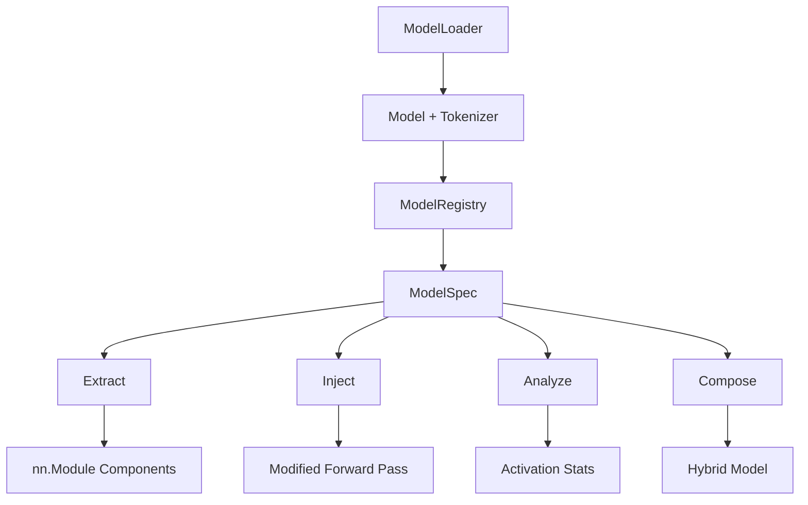

# Core Concepts

Model Garage treats neural networks as machines with accessible, modifiable parts. This page explains the key abstractions.

## The Garage Metaphor

Every tool in Model Garage maps to a mechanic's toolkit:

| Garage Tool | Mechanic's Equivalent | What It Does |
|---|---|---|
| **Core** (loader, hooks, tensor) | Central air compressor | Powers everything else |
| **Extractors** | Wrenches & socket sets | Pull components out of models |
| **Injectors** | Pneumatic tools | Install new parts mid-layer |
| **Analyzers** | Diagnostic scanner (OBD-II) | Read what each component is doing |
| **Composers** | Engine build bench | Assemble hybrids from extracted parts |
| **Registry** | Parts catalog | Track what you have and where it came from |
| **Snapshots** | High-speed camera | Capture hidden states in motion |

## Architecture



## Key Objects

### ModelLoader

Loads any HuggingFace model by name or path. Returns the model, tokenizer, and metadata.

```python
loader = ModelLoader()
model, tokenizer, info = loader.load("gpt2")
```

### ModelSpec

A decomposition of a model into named parts with metadata: dimensions, layer indices, component types. Created by `ModelRegistry.register()`.

### PartSpec

Describes a single extractable component: its type (attention, FFN, embedding, norm), dimensions, and module path within the model.

### PyTorchExtractor

The extraction engine. Given a model identifier, it loads the model and uses architecture patterns to locate and extract individual components as standalone `nn.Module` objects.

### LayerInjector

A context manager that temporarily modifies a model's forward pass. Supports:

- **Scaling** — multiply activations by a constant
- **Custom layers** — insert an arbitrary `nn.Module` between layers
- **Blades** — inject pre-trained hidden state modifications

### HookManager

Low-level hook registration for capturing intermediate activations during forward passes. Used internally by analyzers and snapshot capture.

### SnapshotCapture

High-level API for capturing hidden states at specified layers. Returns statistics like mean activation, sparsity, and entropy.

## The Four Layers of Value

```
Layer 4: Pipeline Systems
         Complete workflows for specific applications

Layer 3: Methodologies
         Validated processes (blade injection, capability transfer)

Layer 2: Combinations
         Research insights from mixing and analyzing components

Layer 1: Platform
         The toolkit itself — extract, inject, analyze, compose
```

Model Garage starts at Layer 1 and grows upward as the community discovers new combinations and methodologies.

## Component Types

Model Garage recognizes these component types in transformer architectures:

| Type | Description | Example Module Path |
|------|-------------|-------------------|
| `self_attention` | Multi-head attention mechanism | `transformer.h.6.attn` |
| `ffn` | Feed-forward network (MLP) | `transformer.h.6.mlp` |
| `embedding` | Token + position embeddings | `transformer.wte` |
| `layer_norm` | Normalization layers | `transformer.h.6.ln_1` |
| `lm_head` | Output projection to vocabulary | `lm_head` |

## Supported Model Families

Each model family has a `ModelDecomposer` that understands its architecture. 70+ models have been validated, but Model Garage works on **any PyTorch transformer** — if a model uses standard attention/FFN/norm patterns, existing decomposers will detect it automatically. Adding support for a new family is a single class. See the [full list of validated models](../index.md#supported-architectures) or learn how to [contribute a new family](../contributing.md).
