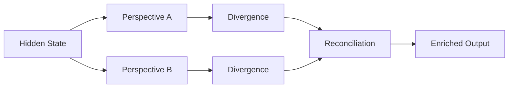

# Self-Debate Chambers

Add multi-perspective reasoning to any model by splitting hidden states into divergent perspectives, processing them separately, and reconciling through learned gating.

## Basic Usage

```python
import torch
from model_garage.core.loader import quick_load
from model_garage.inject.debate import SelfDebate

model, tokenizer, _ = quick_load("gpt2")
input_ids = tokenizer("Artificial intelligence will", return_tensors="pt").input_ids

debate = SelfDebate(
    model,
    layer_idx=6,
    divergence_method="dropout",
    divergence_strength=0.15
)

with debate:
    with torch.no_grad():
        output = model.generate(
            input_ids,
            max_new_tokens=30,
            do_sample=True,
            temperature=0.8
        )
    info = debate.get_debate_info()

print(tokenizer.decode(output[0], skip_special_tokens=True))
```

## How It Works



1. **Split** — The hidden state at the injection layer is duplicated
2. **Diverge** — Each copy is perturbed differently (dropout, noise, scaling)
3. **Process** — Both perspectives pass through the rest of the layer
4. **Reconcile** — The two outputs are merged via gating, averaging, or learned combination

## Divergence Methods

| Method | Description | Best For |
|--------|-------------|----------|
| `dropout` | Random dropout with different masks | General exploration |
| `noise` | Gaussian noise injection | Robustness testing |
| `scaling` | Different scale factors per perspective | Amplitude analysis |

## Reconciliation Methods

| Method | Description | Quality |
|--------|-------------|---------|
| `gated` | Learned gating mechanism | Best (+8.9% vs identity) |
| `average` | Simple mean of perspectives | Good baseline |
| `weighted` | Fixed weighted combination | Manual control |

## Inspecting Debate Results

```python
info = debate.get_debate_info()
for round_info in info:
    print(f"Cosine similarity: {round_info['cosine_similarity']:.4f}")
```

The cosine similarity between perspectives tells you how much the debate created genuine diversity:

- **> 0.99** — Perspectives are nearly identical (increase divergence strength)
- **0.90 - 0.99** — Healthy divergence with maintained coherence
- **< 0.90** — Strong divergence (may impact fluency)

## Configuration

```python
debate = SelfDebate(
    model,
    layer_idx=6,                    # Which layer to split at
    divergence_method="dropout",     # How to create diversity
    divergence_strength=0.15,        # How much divergence
    reconciliation_method="gated",   # How to merge perspectives
)
```

!!! tip "Layer Selection"
    The **N-4 rule** from the [Blades research](../research/blades.md) applies here too.
    For a 12-layer model, layer 8 (= 12 - 4) tends to produce the best results.

## Next Steps

- Read the [Blades paper](../research/blades.md) for the validated principles behind injection
- [Analyze](analysis.md) how debate affects hidden state statistics
- [Extract](extraction.md) the debate layer for use in other models
